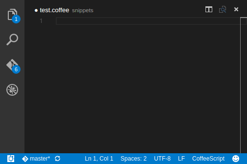

# CoffeeScript Snipets for Visual Studio Code
Useful CoffeeScript code snippets for Visual Studio Code.
Contains snippets from Atom.

## Usage

- `cla` creates a new class
- `el` creates an else block
- `elif` creates an else-if block
- `error` creates an error throw statement
- `fora` for array comprehension `for element in array`
- `foro` for object comprehension `for property of element`
- `forr` for tange comprehension `for element in [start..finish] by step`
- `f` creates a new function
- `if` creates an if block
- `ift` creates a ternary if statement `if condition then value`
- `kv` creates a key and value statement `key: value`
- `log` creates a console log call `console.log value`
- `req` creates a require statement `fs = require 'fs'`
- `try` creates a try-catch block
- `warn` creates a console warn call `console.warn value`
- `info` creates a console info call `console.info value`

## Installation
- Open Visual Studio Code and launch the command palette
- Type in `ext install coffeescript-snippets` and select the package
- Restart Visual Studio Code

## Contributing
Feel free to send pull requests!

## Links 
- [GitHub repository](https://github.com/ronaldloyko/vscode-snippets-coffeescript)
- [Extension page in VS Code Extension Marketplace](https://marketplace.visualstudio.com/items?itemName=ronaldloyko.coffeescript-snippets)

## License
MIT